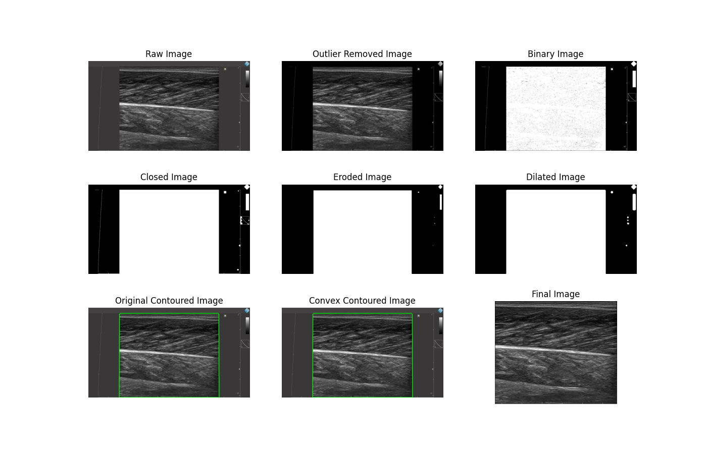
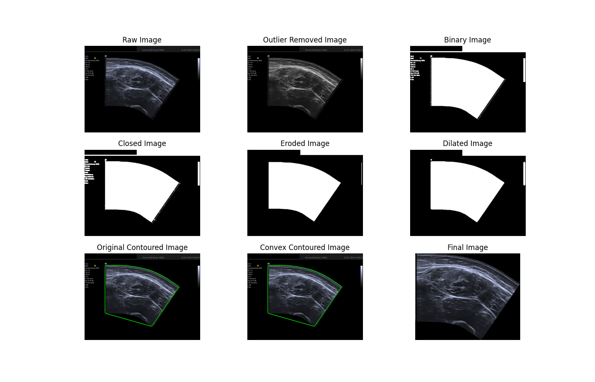
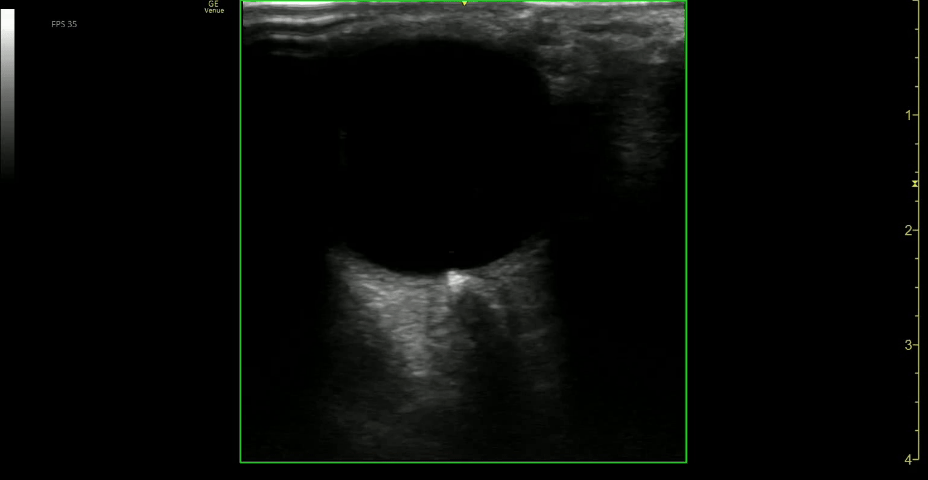

# Ultrasound Video Preprocessing Toolkit

A toolkit for processing ultrasound videos with background removal and intelligent cropping. Preserves directory structures while processing batches of videos.

## Features

- 🎥 Automatic background removal and content-aware cropping
- 📊 Dimension analysis and reporting
- 🖥 Multi-threaded processing
- 📁 Directory structure preservation
- 🔍 Quality control tools for low-reduction cases

## Examples

### Image Cropping



### Video Processing


## Installation

1. Clone repository:
```bash
git clone https://github.com/yourusername/ultrasound-processing.git
cd ultrasound-processing
```

2. Install dependencies:
```bash
pip install opencv-python numpy tqdm
```

## Quick Start

Process a directory of videos:
```python
from ultrasound_cropping.video_preprocessing import process_video_directory

process_video_directory(
    input_dir="./raw_videos",
    output_dir="./processed",
    frame_skip=10,
    crop_extra_off_top=True,
    max_workers=4
)
```

## Core Functions

### 1. Background Removal (`remove_background`)
```python
from remove_background import remove_background

# Returns cropped frame and bounding box
cropped_frame, bbox = remove_background(input_frame)
```
**Parameters**:
- `input_frame`: BGR image array (H x W x 3)

**Returns**:
- `cropped_frame`: Background-removed image
- `bbox`: Bounding box object with properties:
  - start_x, start_y: Top-left coordinates
  - end_x, end_y: Bottom-right coordinates

### 2. Directory Processing (`process_video_directory`)
```python
process_video_directory(
    input_dir="clinical_videos",
    output_dir="processed_videos",
    frame_skip=15,
    crop_extra_off_top=False,
    max_workers=8
)
```
**Parameters**:
| Parameter | Type | Default | Description |
|-----------|------|---------|-------------|
| `input_dir` | str | Required | Root directory with input videos |
| `output_dir` | str | Required | Output directory for processed videos |
| `frame_skip` | int | 10 | Process every Nth frame for crop detection |
| `crop_extra_off_top` | bool | True | Remove 10% from top edge |
| `max_workers` | int | 4 | Parallel processing threads |

### 3. Crop Visualization (`visualize_crop_boundaries`)
```python
from video_preprocessing import visualize_crop_boundaries

visualize_crop_boundaries(
    "input.mp4",
    "crop_visualization.mp4",
    frame_skip=20
)
```
Creates a video with green rectangles showing detected crop boundaries.

### 4. Dimension Analysis (`analyze_dimension_changes`)
```python
from video_preprocessing import analyze_dimension_changes

analyze_dimension_changes(
    "processed/video_dimensions.csv",
    top_n=30
)
```
Sample output:
```
Top videos by area reduction percentage:
--------------------------------------------------
Video File               Input Dims  Output Dims  Reduction %
--------------------------------------------------
heart_scan45.mp4         1920x1080    640x480        88.2%
abdominal_32.mp4         1280x720     512x512        85.1%
```

### 5. Quality Control Copying (`copy_videos_with_low_reduction`)
```python
from video_preprocessing import copy_videos_with_low_reduction

copy_videos_with_low_reduction(
    "processed/video_dimensions.csv",
    "processed",
    "quality_review",
    threshold=85.0
)
```
Copies videos with below a specified size reduction threshold to remove poorly cropped videos.

## Output Structure
```
processed/
├── video_dimensions.csv
├── category1/
│   ├── video1.mp4
│   └── video2.mp4
└── category2/
    ├── video3.mp4
    └── video4.mp4
```

## Advanced Usage

### Customizing Crop Detection
Adjust detection frequency with `frame_skip`:
- Lower values (5-10): Better for moving probes
- Higher values (20-30): Faster processing for static content

### Edge Cropping Control
Disable top edge cropping for full content:
```python
process_video_directory(..., crop_extra_off_top=False)
```